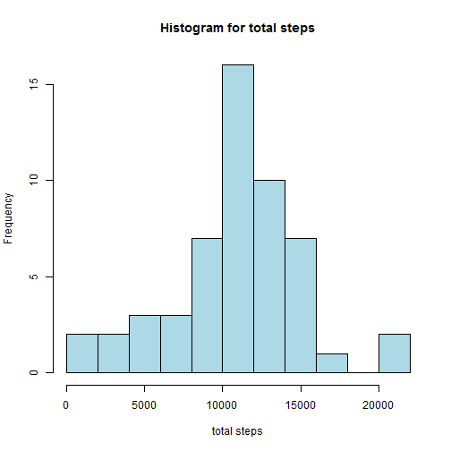
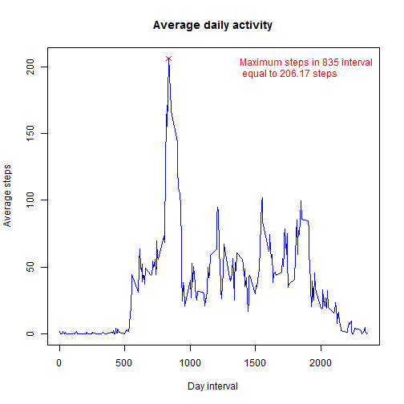
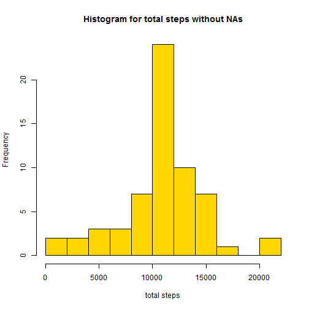
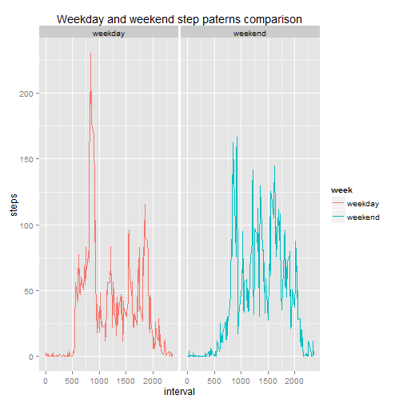

#PROJECT 1

This is a work done for Coursera Course *Reproducible Research* of the [datascience specialization](https://www.coursera.org/specializations/jhudatascience) 

#Data

The data for this assignment can be downloaded from the course web site:

Dataset: [Activity monitoring data](https://d396qusza40orc.cloudfront.net/repdata%2Fdata%2Factivity.zip) [52K]
The variables included in this dataset are:

steps: Number of steps taking in a 5-minute interval (missing values are coded as NA)

date: The date on which the measurement was taken in YYYY-MM-DD format

interval: Identifier for the 5-minute interval in which measurement was taken

The dataset is stored in a comma-separated-value (CSV) file and there are a total of 17,568 observations in this dataset.

###Loading and preprocessing the data


```r
setwd("E:/RepData_PeerAssessment1") #You should set your own working directory

# Download And Unzip Data

download.file("https://d396qusza40orc.cloudfront.net/repdata%2Fdata%2Factivity.zip", destfile="Proj1.zip")
unzip("Proj1.zip")

# read the data into R
data <- read.csv("activity.csv")

#Format date
data$date= strptime(data$date, "%Y-%m-%d")
```


We are going to use the [plyr package](https://cran.r-project.org/web/packages/plyr/index.html) to make summarizing easier


```r
#install.packages("plyr")
library(plyr)
```

###What is mean total number of steps taken per day?


```r
totalsteps= ddply(data, "date", summarize,  steps=sum(steps)) #Here we sum the number of steps for each date
```


```r
hist(totalsteps$steps, breaks=11, main= "Histogram for total steps", xlab="total steps", col= "lightblue")
```

 


```r
mean(totalsteps$steps, na.rm=TRUE)
```

```
## [1] 10766.19
```

```r
median(totalsteps$steps, na.rm=TRUE)
```

```
## [1] 10765
```

###What is the average daily activity pattern?

```r
maxsteps= ddply(data, "interval", summarize,  steps=mean(steps,na.rm=TRUE))
max= maxsteps[which(maxsteps$steps==max(maxsteps$steps)),]
plot(maxsteps$interval,maxsteps$steps,type="l", main= "Average daily activity", ylab="Average steps", xlab="Day interval", col="blue", cex=2)
points(max$interval, max$steps, col="red", pch=4)
legend("topright",legend = paste("Maximum steps in",max$interval, "interval", "\n equal to",round(max$steps,2), "steps" ),text.col = 'red',bty = 'n')
```

 

###Imputing missing values

Note that there are a number of days/intervals where there are missing values (coded as `NA`). The presence of missing days may introduce bias into some calculations or summaries of the data.
Total number of `NA`:

```r
sum(is.na(data$steps))
```

```
## [1] 2304
```

I'll calculate the mean per interval to use this values as replacement for the missing values in each interval


```r
intervalsteps= ddply(data, "interval", summarize,  steps=mean(steps, na.rm=TRUE))

#Identify NAs in data
NAdata=data[which(is.na(data$steps)),]

#Match interval mean value with NA data
complete=match(NAdata$interval, intervalsteps$interval)

#Replace NAs with new data
newdata= data
newdata[which(is.na(data$steps)),"steps"]=intervalsteps[complete,"steps"]
```

Lets plot the histogram for the new data to see if it is different from the previous one


```r
newtotalsteps= ddply(newdata, "date", summarize,  steps=sum(steps))

hist(newtotalsteps$steps, breaks=11, main="Histogram for total steps without NAs", xlab="total steps", col="gold")
```

 

Now i will compare the mean and the median


```r
mean(newtotalsteps$steps )
```

```
## [1] 10766.19
```

```r
median(newtotalsteps$steps)
```

```
## [1] 10766.19
```

The mean and the median have little to no variation after replacing missing values with the mean value for each interval so we can conclude that the impact of the missing data seems rather low.


###Are there differences in activity patterns between weekdays and weekends?

Configure the system locale because my locale is in spanish

```r
#Set an english locale for the proper work of weekdays function

Sys.setlocale("LC_ALL","English")
```

Define weekdays and weekends

```r
#Define weekdays and weekends

weekend= c("Saturday","Sunday")

newdata$week <- ifelse(as.character(weekdays(newdata$date)) %in% weekend, 
c("weekend"), c("weekday")) 

#Summarize intervals mean by weekday
weeksteps= ddply(newdata, c("week","interval"), summarize,  steps=mean(steps))
```

To make this plot i will use the [ggplot2](http://ggplot2.org/) plotting system


```r
#install.packages("ggplot2")
library(ggplot2)

#Plot
qplot(data=weeksteps, x= interval, y= steps, facets=.~week, geom="line", main="Weekday and weekend step paterns comparison", col=week)
```

 


